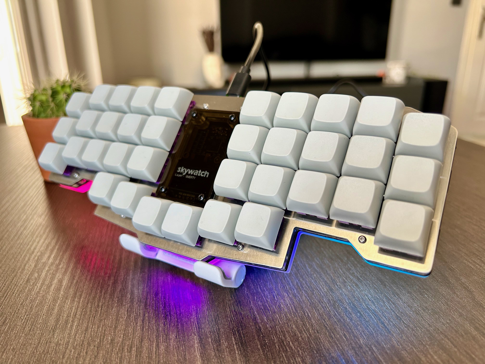
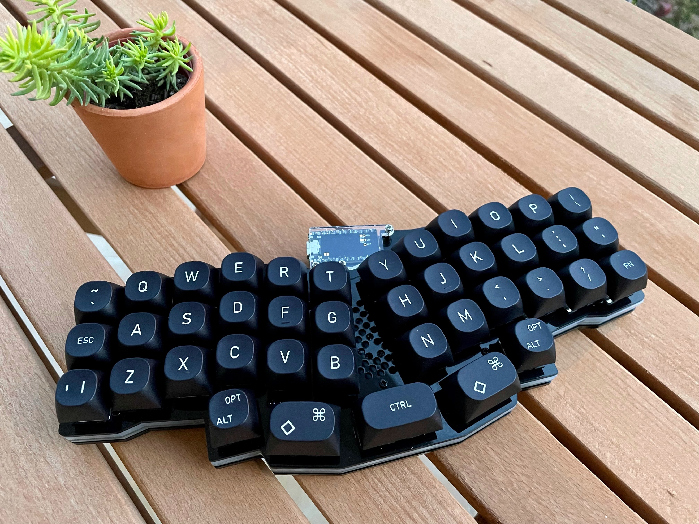
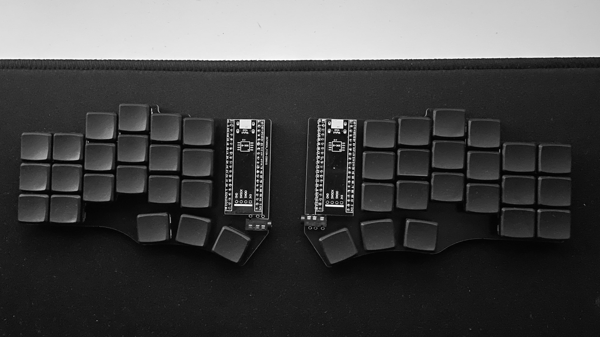
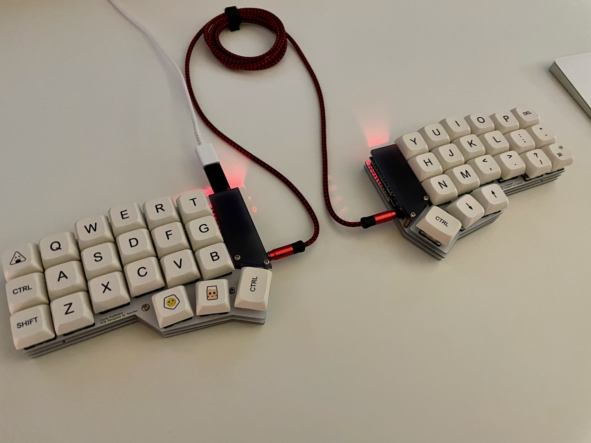
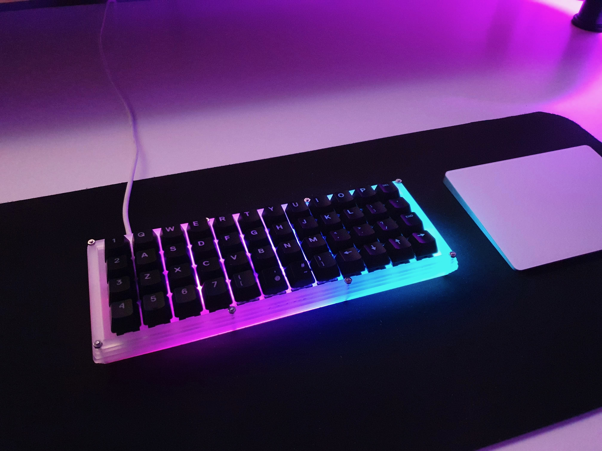
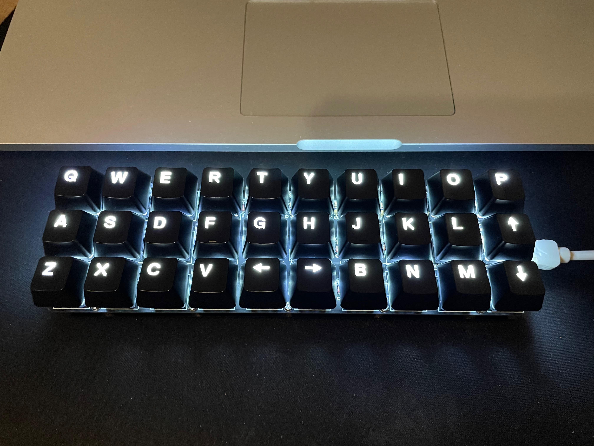

## QMK Configs for various keyboards

This repo contains my personal QMK configs for various keyboards.

### Status of the keyboards

| Keyboard  | Status      |
| --------- | ----------- |
| Skywatch  | Not Started |
| Reviung41 | Available   |
| Cantor    | Available   |
| Corne     | Available   |
| Planck    | Available   |
| Gherkin   | Available   |

### Skywatch Layout

### Reviung41 Layout

### Cantor Layout

### Corne Layout

### Planck Layout

### Gherkin Layout

Check out the website to learn more: https://qmk.fm
